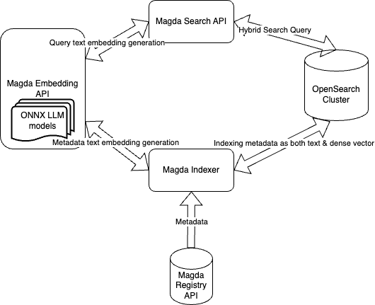

### Overview

[Magda](https://magda.io) is a federated data catalog platform that allows you to aggregate dataset metadata from different sources, systems, and platforms, making them discoverable via a central search engine built on top of OpenSearch.

Previously, Magda's search engine only supported keyword-based (lexical) search. However, search technologies have evolved significantly in recent years, moving from simple keyword-based searches to sophisticated AI-driven semantic searches.

Lexical search (also called keyword-based or traditional search) is a method that retrieves documents based on exact matches between query terms and indexed terms. This is the foundation of search engines like Elasticsearch, OpenSearch, Solr, and traditional SQL `LIKE` queries. It's fast, efficient, and optimized for speed, making it ideal for structured or high-speed search requirements. Moreover, it's deterministic—meaning it always returns exact matches, making it reliable in cases where precision is needed. However, it has a limited understanding of meaning and cannot capture context or the intent behind a query.  
For example, a keyword search can't distinguish between "chocolate milk" and "milk chocolate" or between "I am sure I’m right" and "Take a right turn."

Vector search, also called semantic search, neural search, or embedding-based search, is a retrieval method that represents text, images, and other data as high-dimensional numerical vectors and finds results based on their semantic similarity rather than exact keyword matches. Due to advances in deep learning, LLM (Large Language Model) embeddings, and efficient vector databases, vector search has become much more popular in recent years. Instead of relying on term-based indexing (like traditional search engines), vector search encodes meanings and relationships in a continuous vector space, allowing it to find conceptually relevant results—even when a query uses different words than those in the documents.  
However, vector search is not well suited for searching specific domain-related keywords, especially when dealing with structured queries, exact values, and technical terms such as shoe sizes, model numbers, serial numbers, or product SKUs.

Hybrid search combines lexical and semantic search, leveraging both exact keyword matching and approximate meaning (vector embeddings) to deliver the most relevant and precise results. It runs both keyword-based and vector-based searches in parallel and merges results using a ranking algorithm. This approach allows for structured filtering (from keyword search) while incorporating semantic understanding (from vector search).

This is why we implemented the new hybrid search engine in Magda v5.0.0. It addresses the weaknesses of both keyword and semantic search, improving search result relevance while supporting Magda's new in-browser LLM-powered chatbot feature. The diagram below shows the architecture of our hybrid search engine:

> **Note:** The Magda Embedding API is not part of the main repository. You can find its source code here: [magda-embedding-api](https://github.com/magda-io/magda-embedding-api).

---

### Configuration

By default, the hybrid search engine is enabled. You can disable this feature by setting the Helm chart configuration `global.searchEngine.hybridSearch.enabled` to `false`.

> **Note:** To apply changes to this setting in an existing v5.0.0 deployment, you need to manually delete the dataset index and trigger a reindex action via the [indexer's `reindex` API](https://dev.magda.io/api/v0/apidocs/index.html#api-Indexer-PostV0IndexerReindex).

There are additional configuration options that allow you to fine-tune the performance of the search engine. You can find relevant configuration options in [common.conf](../../magda-scala-common/src/main/resources/common.conf). You can update configuration values via the `appConfig` field in both the [indexer](../../deploy/helm/internal-charts/indexer/README.md) and [search API](../../deploy/helm/internal-charts/search-api/README.md) Helm chart configurations.

> **Note:** You must set the same configuration values for both the [indexer](../../deploy/helm/internal-charts/indexer/README.md) and [search API](../../deploy/helm/internal-charts/search-api/README.md) Helm charts.
