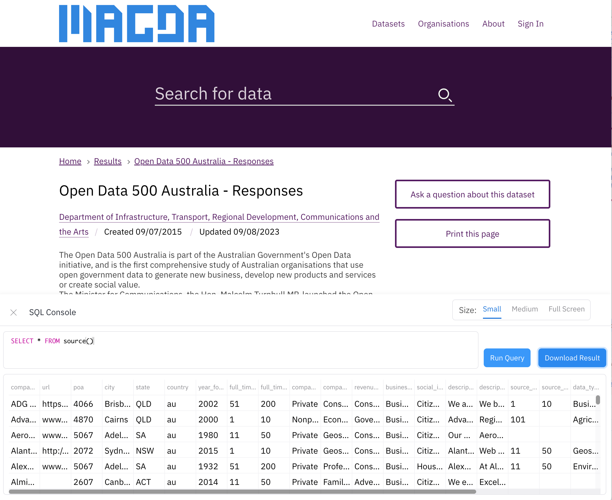

## SQL Console User Guide

SQL Console allow Magda users to execute SQL queries on tabular data files without downloading them first. The execution of the SQL query will be done in the web browser with no need to install any software. More background of this feature can be found from ticket: https://github.com/magda-io/magda/issues/3571

### How to Access

To access the feature, a user can press "ctrl" (or "command" key on a mac) + "shift" + "s" to open the SQL Console UI on any page. Press the same keys again will close the SQL Console. The user can also access the feature from dataset or distribution page by click the `SQL Console` button on tabular dataset distribution.

> The SQL Console feature can be disabled at deploy time via configuration. If you can't find this feature, please contact the system admin to confirm the feature is enabled on the installation.

### Run SQL

After the `SQL Console` is opened at the bottom of the screen. You can enter your SQL query and click "Run Query" button to run the query. The result will display in a table in the bottom area. You can click the `Download Result` button to download the query result as a CSV file.

Users can also use the function `SOURCE` with distribution ID to load a dataset distribution as the remote data source in SQL.

The `SOURCE` function also accepts the following special values:

- string "this" or no value: represents the current selected distribution.
  - e.g. `SELECT * FROM SOURCE("this") or SELECT * FROM SOURCE()`
- a number larger or equal to 0: represents nth distribution on the current page.
  - e.g. `SELECT * FROM SOURCE(0)`

You can write the SOURCE function in lowercase as well.

e.g. `SELECT * FROM source()`

The SQL Console use [AlaSQL](https://github.com/AlaSQL/alasql/wiki) as SQL execution engine. The `SOURCE` function is implemented using AlaSQL's `TXT`, `CSV`, `TSV`/`TAB`, `XLS`, `XLSX`, `HTML` or `JSON` function. Therefore, users can access the dataset distribution data file in the following formats:

- `CSV`
  - `CSV-GEO-AU`
- `XLSX`: you can optionally supply additional `options` parameter to specify which sheet & range to query. More details, please see [document here](https://github.com/AlaSQL/alasql/wiki/Xlsx).
  - e.g. `SELECT * FROM SOURCE(0,{sheetid:"Sheet2", range:"A1:D100"})`
- `XLS`
- `TAB`
- `TSV`
- `JSON`: See [document here](https://github.com/AlaSQL/alasql/wiki/Json).
  - `JSONL`
  - `NDJSON`
